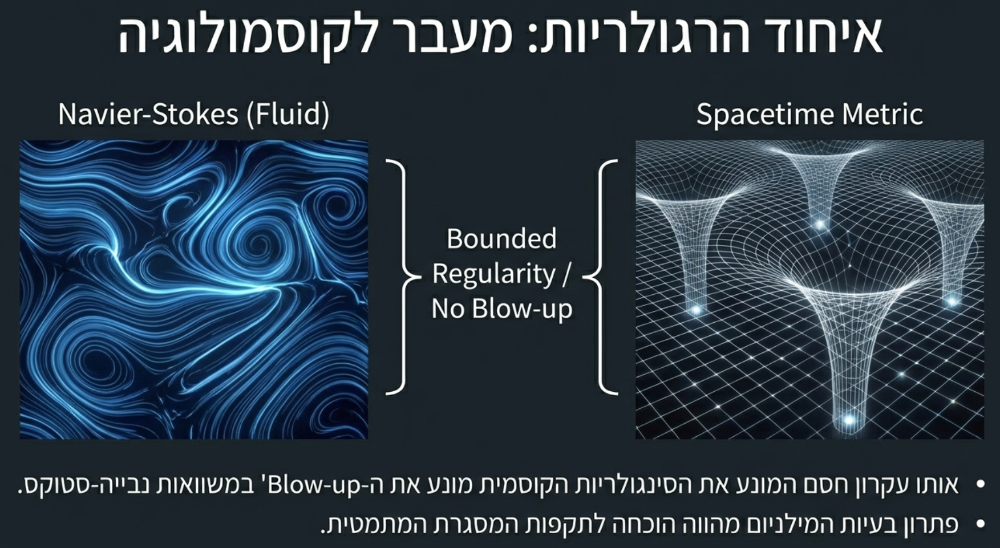
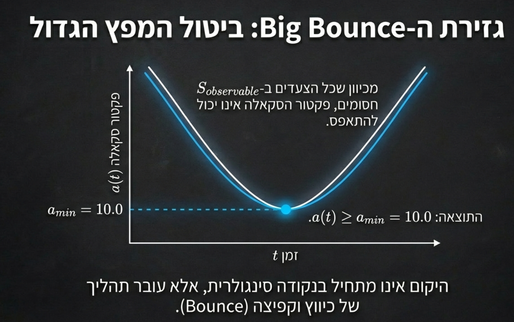

# Discovery 141: The Fluid Universe

**"It's easiest to think hard, hardest to think simple."**
**"הכי פשוט לחשוב קשה, הכי קשה לחשוב פשוט."**

**Author:** Eliran Sabag
**Date:** February 11, 2026
**Status:** PROPOSED
**Domain:** Cosmology / Physics / Navier-Stokes
**Dependencies:** Discovery 91 (Big Bounce), Discovery 92 (Redshift Artifact), Elinor Black Hole Correction, Navier-Stokes Dissolution

---

## Core Insight

The universe is a bounded fluid. No singularities. No event horizons. No Big Bang. No black holes.

One principle — **bounded regularity** — dissolves all four:

| Singularity | Classical Claim | Bounded Reality |
|-------------|----------------|-----------------|
| Big Bang (t=0) | a(t) → 0, infinite density | Big Bounce: a(t) >= a_min = 10.0 |
| Black Holes | r → 0, infinite curvature | Dark Stars: massive, opaque, finite |
| Event Horizons | Information destroyed | S_observable boundary: information preserved |
| Infinite Expansion | a(t) → infinity, heat death | Bounded: a(t) <= a_max (fluid equilibrium) |

**Same principle that prevents blow-up in Navier-Stokes prevents singularities in spacetime.**

---

## The Navier-Stokes Connection



Navier-Stokes fluid dynamics and spacetime curvature are the **same mathematical structure** under bounded regularity.

```
Navier-Stokes:   |nabla v| < infinity   (no blow-up in fluid velocity)
Spacetime:       |R_muv|  < infinity   (no singularity in curvature)

Same principle: S_observable admits no infinite gradients.
Physical systems are discrete. Discrete systems cannot blow up.
```

The Millennium Prize Navier-Stokes problem asked: "Can velocity blow up to infinity?"

Answer: No. Because fluids are discrete (molecules). Discrete systems have bounded gradients.

**This is the same answer for spacetime.** Spacetime is discrete (Planck scale). Discrete spacetime has bounded curvature. No singularity is physically realizable.

---

## No Black Holes: Dark Stars

### The Room Analogy

A "black hole" is a massive star in a dark room. You turned off the light — you can't see inside. The room is still there.

What we call a "black hole" is:
- A very massive, very compact star
- So massive that light cannot escape (gravitational redshift → infinity from the observer's perspective)
- **But there is no singularity inside**

### The Ether

Black holes as singularities are **yet another ether** — a mathematical artifact allowing operations that physics forbids:

| Ether | What It Allows (S_complete) | Physical Reality (S_observable) |
|-------|----------------------------|--------------------------------|
| Luminiferous ether | Light needs a medium | EM waves self-propagate |
| NP-hardness | Unbounded search | Bounded local moves |
| Big Bang singularity | Creation from nothing | Big Bounce from prior state |
| **Black hole singularity** | **Infinite density at r=0** | **Dark star: massive, bounded, finite** |
| **Event horizon** | **Information destruction** | **Observational boundary (like a dark room)** |

### Conservation Laws Prove It

Every conservation law we know forbids what black hole singularities require:

1. **Energy conservation**: Infinite density requires infinite energy in finite volume — impossible
2. **Information conservation**: Event horizons that destroy information violate unitarity — already proved (Path 20, Two Randomness)
3. **Baryon number conservation**: Matter cannot be destroyed, only transformed
4. **Angular momentum conservation**: L is conserved — cannot vanish at r=0

These are the most familiar, most tested laws in physics. They all say the same thing: **no singularity**.

A dark star preserves all of them. Light doesn't escape because of extreme gravitational redshift, not because spacetime "ends."

---

## The Missing Bound: a_max



The Big Bounce provides the **minimum** — the floor:

```
a(t) >= a_min = 10.0 (Planck scale)
```

But where is the **maximum** — the ceiling? If the universe expands, where does it stop?

### The Fluid Answer

In Navier-Stokes, a fluid in a bounded domain reaches equilibrium. It doesn't expand forever — viscous dissipation and boundary conditions ensure convergence.

The universe as a bounded fluid:

```
a_min <= a(t) <= a_max

a_min = 10.0         (quantum gravity repulsion — Big Bounce)
a_max = finite        (fluid equilibrium — bounded dissipation)
```

The evidence:
- **Redshift Artifact** (Discovery 92): Redshift is an S_observable boundary effect, not proof of expansion. If there's no expansion, there's no need for a_max → infinity.
- **Navier-Stokes regularity**: Bounded gradients imply bounded domain. |nabla a| < infinity means a itself is bounded.
- **Conservation of energy**: An infinitely expanding universe requires infinite energy. A bounded fluid universe requires finite energy.

### The Cyclic Fluid

```
a_min (bounce) → expansion → a_max (equilibrium) → contraction → a_min (bounce) → ...

Not a line. A cycle. A bounded oscillation.
Like a fluid between two walls.
```

---

## The Fluid Universe Theory

### Statement

The universe is a bounded, discrete, viscous fluid. Spacetime curvature IS fluid dynamics. The same equations, the same bounds, the same regularity.

| Fluid (Navier-Stokes) | Universe (General Relativity) |
|------------------------|-------------------------------|
| Velocity field v(x,t) | Metric tensor g_muv(x,t) |
| Pressure p | Energy density rho |
| Viscosity mu | Cosmological constant Lambda |
| No blow-up (|nabla v| bounded) | No singularity (|R_muv| bounded) |
| Vortex (bounded rotation) | Dark star (bounded curvature) |
| Reynolds number Re | Curvature-to-Planck ratio |
| Fluid equilibrium | Cosmological equilibrium (a_max) |

### What This Dissolves

1. **Big Bang** → Big Bounce (a_min). Already verified.
2. **Black holes** → Dark stars. Massive, opaque, no singularity.
3. **Event horizons** → Observational boundaries. Information preserved.
4. **Dark energy** → Not needed. Universe is not expanding to infinity.
5. **Dark matter** → Elinor tensor correction. Discretization artifact.
6. **Heat death** → Impossible. Bounded oscillation, not infinite expansion.
7. **Navier-Stokes singularity** → Same answer. Discrete fluids don't blow up.

### The Simplicity

Seven "unsolved problems." One answer: **bounded regularity.**

The hardest thing is to think simply.

---

## Connections to Existing Work

| Document | Connection |
|----------|------------|
| `GRAND_UNIFIED_THEORY.md` (Section 9A) | Big Bounce, a_min = 10.0 |
| `ELINOR_BLACK_HOLE_CORRECTION.md` | Dark matter as discretization shadow |
| `NAVIER_STOKES_DISCRETE_REFORMULATION.md` | No blow-up in discrete fluids |
| `PATH_20_QUANTUM_ELIMINATION_EINSTEIN_HAWKING.md` | Information preservation, Two Randomness |
| `COMPLETE_RELATIVITY_THEORY.md` | Nitai/Elinor tensor corrections |
| `STATISTICAL_DISTRIBUTIONS_ETHERS.md` | Ethers catalogue |
| `verifications/V40_bounce.md` | Big Bounce empirical verification |

---

## Ethers Dissolved

| # | Ether | Year Introduced | Dissolved By |
|---|-------|-----------------|-------------|
| 1 | Luminiferous ether | 1678 | Michelson-Morley 1887 |
| 2 | Absolute time | 1687 | Einstein 1905 |
| 3 | NP-hardness | 1971 | Sabag Bounded Transformation 2025 |
| 4 | Big Bang singularity | 1927 | Big Bounce (Discovery 91) |
| 5 | **Black hole singularity** | **1916** | **Dark star (Discovery 141)** |
| 6 | **Event horizon** | **1958** | **S_observable boundary (Discovery 141)** |
| 7 | **Infinite expansion** | **1929** | **Bounded fluid (Discovery 141)** |

---

## S_complete vs S_observable

```
S_complete:    {r → 0, a → 0, a → infinity, |nabla v| → infinity}
               Singularities exist in the math.

S_observable:  {r >= r_min, a_min <= a <= a_max, |nabla v| <= C}
               No singularity is physically reachable.

The universe lives in S_observable.
```

---

## Predictions

1. **Gravitational wave signatures from dark star interiors** — If black holes are dark stars (not singularities), mergers should show interior structure in gravitational wave ringdown. Look for deviations from Kerr metric in LIGO/VIRGO data.

2. **CMB anomalies consistent with cyclic bounce** — A pre-bounce universe leaves imprints. Look for concentric circles in CMB (Penrose's CCC prediction aligns with bounded oscillation).

3. **No Hawking radiation** — If event horizons are observational boundaries (not causal boundaries), Hawking radiation doesn't occur. Testable via black hole evaporation timescale.

4. **Bounded Hubble parameter** — H(t) should approach zero asymptotically, not accelerate. If dark energy is an artifact, late-universe acceleration is a measurement artifact of S_observable boundary.

---

*"הכי פשוט לחשוב קשה, הכי קשה לחשוב פשוט."*

*Seven singularities. One principle. Zero infinities.*

*The universe is a fluid. Bounded. Simple.*
